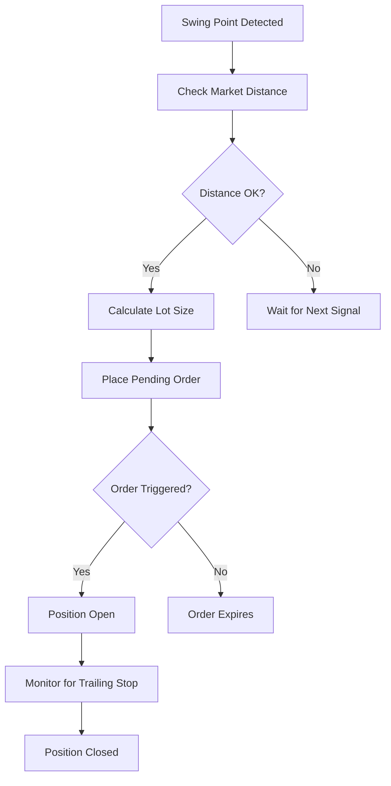

# RaphaelEA Trading Strategy

## Overview

RaphaelEA employs a **swing breakout strategy** combined with **dynamic balance scaling** to capitalize on market momentum while managing risk through intelligent position sizing. The EA identifies significant swing highs and lows, then places pending orders to capture breakout movements.

## Core Strategy Components

### 1. Swing Point Detection

The EA uses a configurable lookback period (`BarsN`) to identify significant swing points:

- **Swing High**: A bar that has the highest high within the lookback period on both sides
- **Swing Low**: A bar that has the lowest low within the lookback period on both sides

```mql5
// Swing High Detection
if(i > BarsN && iHighest(_Symbol, Timeframe, MODE_HIGH, BarsN*2+1, i-BarsN) == i)
{
    // This is a swing high
}

// Swing Low Detection  
if(i > BarsN && iLowest(_Symbol, Timeframe, MODE_LOW, BarsN*2+1, i-BarsN) == i)
{
    // This is a swing low
}
```

### 2. Order Placement Logic

#### Buy Stop Orders
- **Trigger**: Placed above the most recent significant swing high
- **Condition**: Current market price must be at least `OrderDistPoints` below the swing high
- **Rationale**: Captures upward breakouts from consolidation patterns

#### Sell Stop Orders
- **Trigger**: Placed below the most recent significant swing low
- **Condition**: Current market price must be at least `OrderDistPoints` above the swing low
- **Rationale**: Captures downward breakouts from consolidation patterns

### 3. Risk Management

#### Stop Loss & Take Profit
- **Stop Loss**: Fixed distance (`SlPoints`) from entry price
- **Take Profit**: Fixed distance (`TpPoints`) from entry price
- **Risk-Reward**: Configurable ratio based on point settings

#### Trailing Stop Loss
- **Activation**: When position moves `TslTriggerPoints` in favor
- **Distance**: Maintains `TslPoints` distance from current favorable price
- **Purpose**: Protects profits while allowing for continued favorable movement

## Dynamic Balance Scaling

### Core Concept

The EA's most innovative feature is its ability to scale position sizes based on account growth, creating a compounding effect that accelerates wealth accumulation.

### Scaling Methods

#### 1. Linear Scaling
```
New Lot Size = Base Lots × (Current Balance / Initial Balance) × Multiplier
```

#### 2. Exponential Scaling
```
New Lot Size = Base Lots × (Balance Ratio ^ Growth Power) × Multiplier
```

### Balance Scaling Parameters

| Parameter | Description | Default | Range |
|-----------|-------------|---------|--------|
| `UseBalanceScaling` | Enable/disable scaling | true | true/false |
| `AggressiveMultiplier` | Scaling intensity | 2.0 | 0.1 - 10.0 |
| `UseExponentialGrowth` | Exponential vs linear | true | true/false |
| `GrowthPower` | Exponential power | 1.5 | 0.5 - 5.0 |

### Scaling Examples

**Account Growth from $1,000 to $2,000 (2x growth)**

| Method | Calculation | Result |
|--------|-------------|--------|
| No Scaling | 0.1 lots | 0.1 lots |
| Linear (2.0x) | 0.1 × 2.0 × 2.0 | 0.4 lots |
| Exponential (1.5^, 2.0x) | 0.1 × (2.0^1.5) × 2.0 | 0.57 lots |

## Market Analysis

### Timeframe Strategy

The EA operates on a configurable timeframe (`Timeframe` parameter) with these recommendations:

| Asset Class | Recommended Timeframe | Rationale |
|-------------|----------------------|-----------|
| Forex Majors | H1 - H4 | Good balance of signals vs noise |
| Gold/Silver | H1 - H4 | Captures significant moves |
| Cryptocurrency | H4 - D1 | Reduces false breakouts |
| Exotic Pairs | H4 - D1 | Better signal quality |

### Signal Quality Factors

#### High-Quality Signals
- Swing points formed over multiple bars
- Clear consolidation before breakout
- Volume confirmation (if available)
- Confluence with longer-term trend

#### Low-Quality Signals
- Rapid swing point formation
- Choppy, sideways market
- Multiple false breakouts recently
- Counter-trend signals

## Position Management

### Entry Process

1. **Signal Detection**: Identify swing high/low
2. **Market Distance Check**: Ensure minimum distance from current price
3. **Lot Calculation**: Apply risk management and scaling
4. **Order Placement**: Set pending order with SL/TP
5. **Expiration**: Orders expire after `ExpirationHours`

### Position Lifecycle



### Exit Conditions

1. **Stop Loss Hit**: Maximum loss reached
2. **Take Profit Hit**: Target profit achieved  
3. **Trailing Stop**: Profit protection activated
4. **Manual Close**: User intervention
5. **End of Session**: If configured

## Risk Management Framework

### Position Sizing Methods

#### Fixed Lot Size
- Uses base lot size regardless of balance
- Suitable for conservative trading
- Predictable risk per trade

#### Percentage Risk
- Calculates lots based on account percentage at risk
- Adapts to account size changes
- Standard risk management approach

#### Dynamic Scaling
- Combines percentage risk with balance scaling
- Increases position sizes as account grows
- Accelerates wealth accumulation

### Risk Controls

| Control | Purpose | Implementation |
|---------|---------|----------------|
| Max Lot Size | Prevent over-leveraging | Broker symbol specs |
| Min Lot Size | Ensure valid orders | Broker symbol specs |
| Risk Percentage | Limit account risk | User-defined % |
| Stop Loss Distance | Control trade risk | Fixed points from entry |
| Order Distance | Prevent immediate fills | Minimum points from market |

## Performance Optimization

### Parameter Optimization

#### Critical Parameters
1. **BarsN**: Swing detection sensitivity
2. **OrderDistPoints**: Entry timing
3. **TpPoints/SlPoints**: Risk-reward ratio
4. **TslPoints**: Profit protection
5. **AggressiveMultiplier**: Scaling intensity

#### Optimization Process
1. **Backtest Base Strategy**: Establish baseline performance
2. **Optimize Core Parameters**: Find optimal swing detection
3. **Tune Risk Parameters**: Optimize SL/TP distances
4. **Test Scaling Parameters**: Find optimal growth settings
5. **Forward Test**: Validate on unseen data

### Market Adaptation

#### Trending Markets
- Increase `TpPoints` for larger moves
- Reduce `TslPoints` for closer trailing
- Higher `AggressiveMultiplier` for momentum

#### Range-bound Markets
- Reduce `BarsN` for more signals
- Tighter `TpPoints` for quick profits
- Conservative scaling to preserve capital

#### High Volatility
- Increase `OrderDistPoints` to avoid noise
- Wider `SlPoints` for breathing room
- Conservative lot sizing

#### Low Volatility  
- Reduce distances for tighter execution
- More aggressive scaling opportunities
- Higher frequency trading

## Asset-Specific Configurations

### Forex Pairs

#### Major Pairs (EUR/USD, GBP/USD, USD/JPY)
```
BarsN = 5
OrderDistPoints = 150-250
TpPoints = 200-300
SlPoints = 150-200
TslPoints = 20-30
```

#### Minor Pairs (EUR/GBP, AUD/JPY)
```
BarsN = 5-7
OrderDistPoints = 200-300
TpPoints = 250-400
SlPoints = 200-250
TslPoints = 25-35
```

#### Exotic Pairs (USD/SGD, EUR/TRY)
```
BarsN = 7-10
OrderDistPoints = 300-500
TpPoints = 400-600
SlPoints = 300-400
TslPoints = 40-60
```

### Precious Metals

#### Gold (XAU/USD)
```
BarsN = 5
OrderDistPoints = 500-800
TpPoints = 800-1200
SlPoints = 600-800
TslPoints = 100-150
```

#### Silver (XAG/USD)
```
BarsN = 5-7
OrderDistPoints = 200-400
TpPoints = 400-600
SlPoints = 300-400
TslPoints = 50-80
```

### Cryptocurrencies

#### Bitcoin (BTC/USD)
```
BarsN = 7-10
OrderDistPoints = 2000-5000
TpPoints = 5000-10000
SlPoints = 3000-5000
TslPoints = 500-1000
```

#### Ethereum (ETH/USD)
```
BarsN = 5-7
OrderDistPoints = 500-1500
TpPoints = 1500-3000
SlPoints = 1000-1500
TslPoints = 200-400
```

## Strategy Variations

### Conservative Approach
- Lower `AggressiveMultiplier` (1.2-1.5)
- Tighter risk controls
- Longer timeframes
- Higher `BarsN` for quality signals

### Aggressive Approach
- Higher `AggressiveMultiplier` (2.5-4.0)
- Exponential scaling enabled
- Shorter timeframes
- Lower `BarsN` for more signals

### Balanced Approach
- Moderate `AggressiveMultiplier` (1.8-2.2)
- Mixed scaling based on market conditions
- H1-H4 timeframes
- Standard `BarsN` (5-7)

## Common Pitfalls & Solutions

### Problem: Too Many False Breakouts
**Solutions:**
- Increase `BarsN` for stronger swing points
- Add volume confirmation
- Use higher timeframes
- Implement momentum filters

### Problem: Missing Major Moves
**Solutions:**  
- Reduce `BarsN` for earlier signals
- Decrease `OrderDistPoints`
- Monitor multiple timeframes
- Implement trend following filters

### Problem: Excessive Risk During Scaling
**Solutions:**
- Implement maximum lot size limits
- Add equity-based risk controls
- Monitor drawdown levels
- Use conservative multipliers

### Problem: Poor Performance in Sideways Markets
**Solutions:**
- Implement trend filters
- Reduce position sizes in ranging markets
- Use shorter timeframes
- Add market condition detection

## Performance Metrics

### Key Performance Indicators

| Metric | Target | Calculation |
|--------|--------|-------------|
| Win Rate | >45% | Winning Trades / Total Trades |
| Risk-Reward Ratio | >1.2:1 | Average Win / Average Loss |
| Maximum Drawdown | <20% | Peak to Trough Loss |
| Profit Factor | >1.3 | Gross Profit / Gross Loss |
| Sharpe Ratio | >1.0 | (Return - Risk-free) / Volatility |

### Balance Scaling Effectiveness

Monitor these metrics to evaluate scaling performance:

- **Growth Acceleration**: Compare scaled vs non-scaled returns
- **Risk Scaling**: Ensure risk scales proportionally with position size
- **Drawdown Impact**: Monitor if scaling increases drawdown risk
- **Consistency**: Verify performance across different market conditions

## Future Enhancements

### Planned Features
1. **Adaptive Parameters**: Market condition-based parameter adjustment
2. **Multi-Symbol Trading**: Portfolio-based position sizing
3. **News Filter**: Economic event-aware trading
4. **Machine Learning**: Signal quality assessment
5. **Risk Management**: Dynamic stop loss adjustment

### Research Areas
1. **Volatility-Based Scaling**: Adapt to market volatility
2. **Correlation Analysis**: Multi-asset position management
3. **Seasonal Patterns**: Time-based strategy adjustment
4. **Market Regime Detection**: Bull/bear market adaptation
